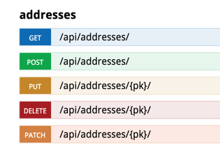

Title: How I'm using RiotJS and Django REST Framework
Date: 2016-3-23 15:10
Category: web development
Tags: python, web development, riotjs, django, django rest framework, drf
Summary: Yo man, what lib you using these days, Angular? React? Vue? Skrible? SomeOtherMadeUpNameJS? What about another one: RiotJS!? <p style="text-align: center;" class="image-wrapper"></p> We'll take a high level look at the tools I'm using on my current projects for making frontend <-> backend work fast and elegantly, in my opinion ;) 


Yo man, what lib you using these days, Angular? React? Vue? Skrible? SomeOtherMadeUpNameJS?

What about another one: RiotJS!?

<p style="text-align: center;" class="image-wrapper">
    <a href="http://riotjs.com/"></a>
</p>

We'll take a high level look at the tools I'm using on my current projects for making frontend <-> backend work fast and elegantly, in my opinion ;)

### What is RiotJS?

[RiotJS](http://riotjs.com/) is "a user interface micro-library for web components." You use it like this:

In RiotJS you make everything as web components. Web components are just a custom tag (like div, a, span, p, etc.) defined so that it has self contained javascript and CSS, like this:

```html
<a-riot-tag>
    <!-- The HTML section -->
    <div onclick="{ clicked }">I'm a dumb tag, click me!</div>
    
    <!-- The javascript section <script> tag is not required, 
    can just end HTML section and start doing JS! -->
    <script>
        // Keep a reference to the tag
        var self = this;

        self.clicked = function() {
            alert('Weee, ya clicked it!')
        }
    </script>
    
    <!-- CSS Section -->
    <style>
        a-riot-tag {
            background-color: red;
        }
    </style>
</a-riot-tag>
```

This structure is actually incredibly beautiful, to me at least. When components feel like they're getting spaghetti, you break functionality down into smaller pieces. For a start, say you want to make an address CRUD (Create Retrieve Update Delete) form, you'd probably have components like:

* `<address-list>` to list out each address
* `<address-form>` to display details for an address and edit them
* `<address>` to display details about the address

You may further break down address into many components, like maybe a `<phone-number>` or `<full-name>` component with special formatting, properties, options, actions, whatever.

<p style="text-align: center;" class="image-wrapper">
    <br>
</p>

Riot components are just custom html tags with some html on top, some javascript and then your styles on the bottom.

This web dev neapolitan seems weird at first... smashing template into logic while stylesheets sit in the corner wondering
how they ended up in this place. However, it actually feels quite nice. Worry shifts from organizing spaghetti
code to solving logic nightmares, because as soon as something "feels weird" you break it off into a new component. 
Smaller/single purpose components are generally much easier to wrap your head around.

When I first started doing this component style, I broke things out into components for no reason. That made things feel
clunky and the usefulness of components wasn't making sense. When the logic flow through a form with a ton of methods 
started feeling funny: I broke the form into components with separate ideas. The components can talk
to each other through `riot.observables` with `observable.trigger('some_event', {some: 'data'})` and 
`observable.on('some_event', function(some_data){})`.

For example, I recently built a `<table>` of users where you could click a row and it would appear in a `<form>`, then
when saved it would update the `<table>`. As I was building this all out it started to feel cumbersome trying to keep 
everything working in the proper order while maintaining some kind of clarity in the code. Then I had a great "A-ha!" 
moment and split the `<table>` and the `<form>` into separate components! 

I didn't also split out the pagination, I didn't split out the `<table>` rows... I simply split it into two big pieces. 
When you split *everything* into a component you get a mess. I find things will naturally split themselves up and 
anything else is "early optimization" and will probably make your code more fragile/hard to follow.


### What is Django REST Framework (DRF)?

[Django REST Framework (DRF)](http://www.django-rest-framework.org/) "is a powerful and flexible toolkit for building Web APIs."

I won't go into much detail about DRF, since it has a lot to do with [Django](https://www.djangoproject.com/) models
and all of the batteries included. Instead, I'll let this small example speak for itself.

Here's an API for CRUD (Create Retrieve Update Delete) of some Addresses for a project I'm working on:


Let's make our views (receives a request, processes it, returns a response)
```python
# views.py
class AddressViewSet(mixins.ListModelMixin,
                     mixins.CreateModelMixin,
                     mixins.UpdateModelMixin,
                     mixins.DestroyModelMixin,
                     viewsets.GenericViewSet):
    serializer_class = serializers.AddressSerializer

    def get_queryset(self):
        if self.request.user.is_superuser or self.request.user.is_staff:
            query = Address.objects.all()
        else:
            query = Address.objects.filter(company=self.request.user.company)
        return query.order_by("name")
```

The above code checks anyone poking at the endpoints and limits so they can only see certain things. 
Super users can see all Addresses, while regular users can only see Addresses for their Company. 
All results are ordered by name. Awesome sauce! Just the logic we need, not much
boiler plate coding. I love Python + DRF!


Now let's serialize our data (receive data -> validate its contents -> save it OR retrieve data -> output its contents) 
```python        
# serializers.py
class AddressSerializer(serializers.ModelSerializer):
    class Meta:
        model = Address
        fields = (
            'id',
            'company',
            'name',
            'address_1',
            'address_2',
            'city',
            'state',
            'zip_code',
            'is_bill_to',
            'is_ship_to',
        )

    def validate(self, attrs):
        if 'is_bill_to' not in attrs and 'is_ship_to' not in attrs:
            raise ValidationError(
                "Must select at least one option: bill to, ship to, or both"
            )

        if Address.objects.filter(company=attrs['company'], name=attrs['name']):
            raise ValidationError(
                "That name is already in use! Please select a different name."
            )

        return super().validate(attrs)
```
Above we're defining which fields we'll pull from the model. Whether the fields are required, what is valid data, etc.
can be determined from the model fields. For example, you could have the `is_bill_to` and `is_ship_to` fields marked
with `default=False` and DRF with automatically mark them as not required, as they have a default. We also check to 
make sure at least one of the previously mentioned options is picked, as well as making sure names are unique to
companies. The unique relation of name->business was be automatically inferred from the Model (awesome!) but the error
message relayed to the user I didn't like, so I wrote this custom instead.

Then attach our view to the router
```python
# urls.py
router.register(r'addresses', views.AddressViewSet, 'addresses')
```

Now I have all of these endpoints available to modify/view Addresses, WITH documentation!

<p style="text-align: center;" class="image-wrapper">
    <br>
</p>


### Tying them together?

I'll briefly go over how to tie these together API-wise, but I'll hand wave away everything to do with building your front end
and serving static content. Pick your poison, there are a million ways to solve those problems! :)

I've recently learned a neat little practice to help with frontend dev is to make a wrapper for your API calls, this
puts all your endpoint URLs in one spot and makes things feel a bit tidier. Previously, I'd define the URLs in one spot, 
grab those and make my call. Now I just return a promise instead.

```javascript
// Our clientside api wrapper
var API = {
    get_addresses: function(filters) {
        return ajax_library('GET', base_url + "api/addresses/", filters)
    }
}
```


In our riot tag we'll display some addresses:
```html
<addresses>
    <ul>
        <li each={ addresses }>{ name } { address_1 } { address_2 } { city } { state } { zip_code }</li>
    </ul>
    
    var self = this
    self.on('mount', function() {
        API.get_addresses()
            .success(function(data) {
                self.update({addresses: data})
            })
            .error(function() {
                alert("Error getting list of addresses!")
            })
    })
</addresses>
```

And in our HTML we'll put the tag:
```
<!-- somewhere in your template -->
<addresses></addresses>
```

So. Easy. 

We can easily extend the address tag to add/remove/modify addresses in beautiful ways, usually based on some events

```javascript
// somewhere global
window.EVENTS = riot.observable()

// in some tag somewhere else
... make addition to address list ...

window.EVENTS.trigger('force_update_address_list');

// in your address list
window.EVENTS.on('force_update_address_list', do_update_address_list);
```

From an even higher level the approach I've used on most CRUD pages goes like this:

1. Get list of objects, display them in a table/list
2. Form for new objects or selecting object to popular form
3. Form creates a new object or edits an existing object
4. Force the list to update and retrieve new/updated object


### Why not React?

I don't like how React forces me to do so many new things, or I feel it does at least. That's not a great or objective
reason. It's similar to how I choose Django + Python over Ruby on Rails, I had a feeling and really enjoyed
one over the other. 

When I use RiotJS I don't feel like I'm fighting anything, or that I'm investing hundreds of hours in a library that
the community will abandon in a few months (Angular1 vs Angular2, then leaving for React). It only took a little while to learn
RiotJS stuff and it was fun. I would run into problems, get lots of help from the Riot community and love how the problem
was solved.

The hardest part about finding the right frontend tool is how much information there is out there, and how fragmented the frontend 
community seems. I don't have time any more to sort through dozens of tutorials and opinions to find the right path. I'm
looking for little communities centered around similar principles so I don't have to constantly try to find the latest
and greatest way to solve the same CRUD problems we face every day. By the time I learned AngularJS a lot of people
had already jumped ship.

<p style="text-align: center;" class="image-wrapper">
    
</p>

Jumping ship may even be worse for backend folks, but from my perspective it seems like backenders aren't switching
tools as often. Maybe backend folks switch between frameworks/paradigms once every 2-4 years, where frontend is about every
6 months. 

It's probably just an outsider perspective, maybe it's not as bad as I think. However, I am still using the same Python
tools as when I started Django about 5 years ago. They've grown and changed slightly, but it seems I've only added
library after library instead of replacing one with the other. Maybe for every ReactJS guy there's still some 
Backbone/mootool/jquery folks wondering why people left perfectly good tools behind?!

With all of that said: React may be the solution to all the problems. I can't say. I haven't taken the time to really
dive into it past a few toy things but I don't really want to. However, there are way smarter people in the community
than myself and they seem to find React the perfect solution. They're way better frontenders than I am!

React + Babel + some nice CSS libraries are probably the way to go if you're a pure frontender (or just love torture)
but, for a mostly backend guy like me the simplicity and "feel" of Riot is irresistible. Things mostly work how they should
and I don't have to learn a billion new things to do something I could have done using jQuery in 5 seconds.
