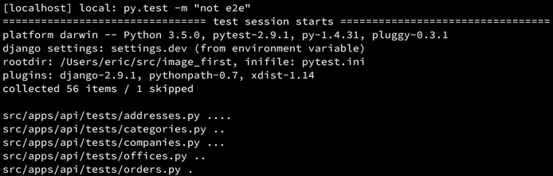
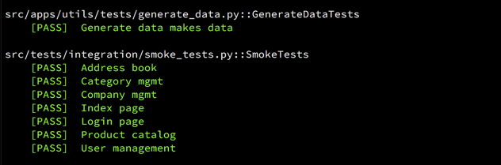

Title: My favorite pytest plugins
Date: 2016-4-19 15:10
Category: development
Tags: python, development


### What is pytest?

> pytest is a mature full-featured Python testing tool that helps you write better programs.

I use pytest on every project because of the ease of use and ability to customize/hook into
certain aspects of the testing processes. For example, if I want to hook in before each test
and process some images (for some reason)... I can do that!

Another great thing about pytest is how easy it is to install plugins. You `pip install` the 
plugin--that's it! No configuration required.


# My faves

### [xdist](https://github.com/pytest-dev/pytest-xdist)

With `xdist` you can run your tests in parallel by providing the `-n` flag.

`py.test -n 4` will run 4 tests at a time.

```
$ py.test -n 4
============================ test session starts ============================
platform darwin -- Python 3.5.0, pytest-2.9.1, py-1.4.31, pluggy-0.3.1
django settings: settings.test (from ini file)
rootdir: /Users/eric/src/, inifile: pytest.ini
plugins: django-2.9.1, pythonpath-0.7, spec-1.0.1, xdist-1.14
gw0 [54] / gw1 [54] / gw2 [54] / gw3 [54]
scheduling tests via LoadScheduling
.....................................
```


### [spec](https://pypi.python.org/pypi/pytest-spec)

Changes our test output from this:

<p align="center" class="image-wrapper">
    <br>
</p>

To this:

<p align="center" class="image-wrapper">
    <br>
</p>

To use this module add the `--spec` flag when running your test, like so:

```
py.test --spec
```


### [pythonpath](https://github.com/bigsassy/pytest-pythonpath)

Not as flashy/useful as the others, but a nice tool to simplify adding
proper python paths to run your tests.

Add `python_paths` to your `pytest.ini` configuration:

```ini
[pytest] 
python_paths = your/path/apps your/path/libs
```


### [instafail](https://github.com/jpvanhal/pytest-instafail)

This plugin instantly shows failed tests instead of waiting until all tests
finish to display the output. Works nicely with `spec` plugin as well.

To use it just add the `--instafail` flag when running your tests, like so:
```
py.test --instafail
```


# Thanks for reading

I know this is kind of a "who cares" blog post, but I'm trying to do at least
one blog a month and this one popped into my head so I went for it!

Hope it was worth something to somebody, there's already a great list of
plugins [here](https://pytest.org/latest/plugins.html) but I didn't see any harm in outlining my faves.

In any case, happy holidays tomorrow everyone! :)