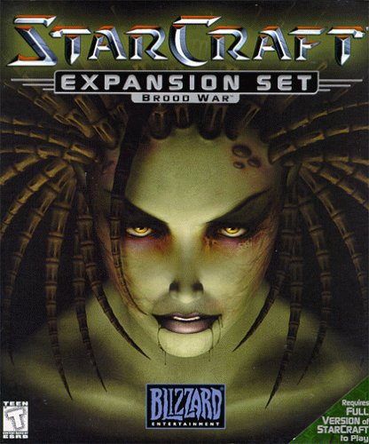

Title: Top 5 gaming documentaries of all time
Date: 2015-5-11 15:10
Category: gaming
Tags: gaming, competition, mindset
Summary: The best of gaming competitiveness, attitude, culture and raw skill. To me these are the documentaries I'll look back at like my dad looks back at Superbowl 1. 

     

Here's the scenario: I am 15 years old playing [StarCraft: Brood War](http://us.blizzard.com/en-us/games/sc/) against someone named "crapball." Ha! What a funny
  name, should be a quick game... no, he beat me! 
  
I begged him for a rematch and thankfully he oblidged. He beat me again. Getting a little upset... I beg him a second time for a rematch, but this
time I won't make such silly mistakes.

He crushed me. We were playing on Lost Temple and he cheesed me by building a pylon where I would put my supply
depot on the ramp. Shit now I can't wall off... what!? Now he's building cannons... that son of a bitch!

Something about how he was playing was beautiful,
I almost beat him every game but he had such clever solutions to problems I thought were insurmountable. I checked the 
replays and he was doing hundreds of actions a minute compared to my dozens.

Something about losing to "crapball" pushed me to keep trying and to find my own style, to be as aggressive as he was
and to make people react to me instead of being the reactionary one. To me, there's as much beauty in these struggles as
with any physical sport. It takes a tremendous amount of determination to succeed at anything, but to be the best 
requires personal sacrifice as well.

## #1 

<iframe 
    width="640" 
    height="360" 
    class="youtube" 
    src="https://www.youtube-nocookie.com/embed/NJztfsXKcPQ" 
    frameborder="0" 
    allowfullscreen>
</iframe>

<i>"My Life of Starcraft"</i>

### My Life of Starcraft - Day[9] Daily #100

[Sean "Day[9]" Plott](http://day9.tv/) walks us through his best and worst experiences in his competitive StarCraft days.
It's tear filled and makes me feel old, I remember seeing "Day9" in the World Cyber Games and rooting against him! 
Very powerful stuff in this video blog.

Nowadays Sean is doing his daily video blogs, some awesome Magic The Gathering games with celebrities called Spell Slingers,
and always promoting a positive attitude.

## #2

<iframe 
    width="640" 
    height="360" 
    class="youtube" 
    src="https://www.youtube-nocookie.com/embed/xMJZ-_bJKdI" 
    frameborder="0" 
    allowfullscreen>
</iframe>

<i>"The King of Kong: Fistful of Quarters"</i>

### King of Kong

[King of Kong](http://www.imdb.com/title/tt0923752/) is the passionate story of Steve Wiebe trying to crush the arrogant and
doofy Billy Mitchell at the classic arcade game Donkey Kong. This shows better than most docs all of the work, emotional pain,
and disappointment we've all faced. Whether it's dealing with our own problems or having a bully knock us down.  

## #3

<iframe 
    width="640" 
    height="360" 
    class="youtube" 
    src="https://www.youtube-nocookie.com/embed/jX9hbbA-WP4" 
    frameborder="0" 
    allowfullscreen>
</iframe>

<i>"The Smash Brothers Documentary"</i>

### The Smash Brothers Documentary

[The Smash Brothers Documentary](https://www.youtube.com/watch?v=jX9hbbA-WP4) details all of the top players throughout the 
history of Smash Bros. It's pretty interesting watching people start the scene, become dominant, get toppled by newcomers 
they destroyed earlier, and then come back for dramatic close wins.

## #4

<iframe 
    width="640" 
    height="360" 
    class="youtube" 
    src="https://www.youtube-nocookie.com/embed/xyjS0Xdzrlc" 
    frameborder="0" 
    allowfullscreen>
</iframe>

<i>"Word Wars"</i>

### Word Wars

[Word Wars](http://www.imdb.com/title/tt0390632/) is a movie about scrabble, which I am *kind of* stretching to fit with the rest
of these, but the theme is the same: hard work leads to incredible things. No matter what that thing is, I can respect
hard work and tremendous sacrifice.

## #5

<iframe 
    width="640" 
    height="360" 
    class="youtube" 
    src="https://www.youtube-nocookie.com/embed/UjZYMI1zB9s" 
    frameborder="0" 
    allowfullscreen>
</iframe>

<i>"Free to Play: The Movie (US)"</i>

### Free to Play: The Movie (US)

[Free to Play](https://www.youtube.com/watch?v=UjZYMI1zB9s&t=1244) a very professional documentary about the recent developments in the 
Dota 2 competitive scene. Millions of dollars are on the line!

