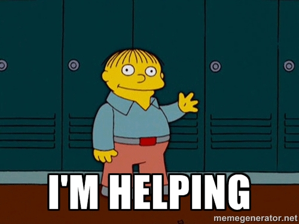

Title: Transitioning from helpless to helpful
Date: 2015-6-9 15:10
Category: development
Tags: python, development
Summary: Four years ago I had no idea what I was doing in Web Development. Asking dumb questions in IRC all day was how I learned, scrounging through tutorials trying to make sense of <i>anything</i>. Now I'm the one answering the dumb questions!

Four years ago I had no idea what I was doing in Web Development. Asking dumb questions in IRC all day was how I 
learned. Scrounging through tutorials trying to make sense of <i>anything</i>. Now I'm the one answering the dumb 
questions!

I felt like writing this because I've just realized that I now hang out in [#django](irc://irc.freenode.net/django) 
and actually spend most of my time giving back instead of taking. To me that's a huge achievement that deserves some
attention, at least.

<p align="center" class="image-wrapper">
    <br>
</p>

It's not uncommon that I leave the IRC window up on my 3rd monitor and glance at it occasionally. More and more I'm 
seeing people ask questions that I have no problem answering... what the hell! Without even realizing it I've 
transitioned from an entry-level-nobody to kinda-somebody-worth-listening-to.


## Being a newb

When I was just getting started I vividly remember being helped by `FunkyBob` multiple times... I had no idea why he was
helping me. Maybe now I'm finally starting to understand why he would helped me, but a few years ago I had no clue. In 
fact, I was so clueless I sent the guy $25 to buy himself a pizza for helping me!

Surely the pizza was a cool way to say "thanks" for all of the help, but that's not the real way to say thanks. The real
way to say thanks would be to, myself, become able to give back to the community. 

Monetary gain is seeming more and more like an empty pursuit. I've never had more money and at the same time I've never
felt so... poor.

By enriching my fellow developer: I'll be the richest man alive.


## The transition

I'm not sure when the switch flipped, but my best guess is recently with changes at work I am seeking out more and more
ways to be proud of what I do. Instead of just getting the work done, I take pride in taking my time implementing a 
better solution. Not something perfect, but something I'm proud of.

I've also made horrendous fuck ups. Huge security holes, missed details, and poorly designed features. Though these seem
like awful things, this where my growth seems to be happening. By being forced to confront these problems without the 
option to give up/change course: I am learning a fuck load.

It's regular to get stuck for hours on something simple like forgetting to pass `*args, **kwargs` to a `super` method,
but in those painful hours I grow and stretch my brain around the problem. When I finally understand *just how stupid 
I am* with the small mistake, it's like taking a load off my shoulders.

Sometimes it feels like I have no idea how I'll get to the finish line on a feature. That's getting more rare. My 
confidence is growing that my weak points are shrinking. In the way I communicate especially.


## Good for you!

I know this is kinda lame congratulating myself... but I'm finally getting happier doing web development, damnit! Our 
job is filled with negativity, set backs, and pressure--so why do we do it? Of course money is there, but that won't keep
me around. 

What will keep me around is this:

```text
rpkilby: Babysuperman, thanks for the help

xcyclist: Yes, that did it. Thanks.

shutupsquare: Hey Thanks, I never even thought to have the items have a fk to the person, perfect, thanks guys.
```
