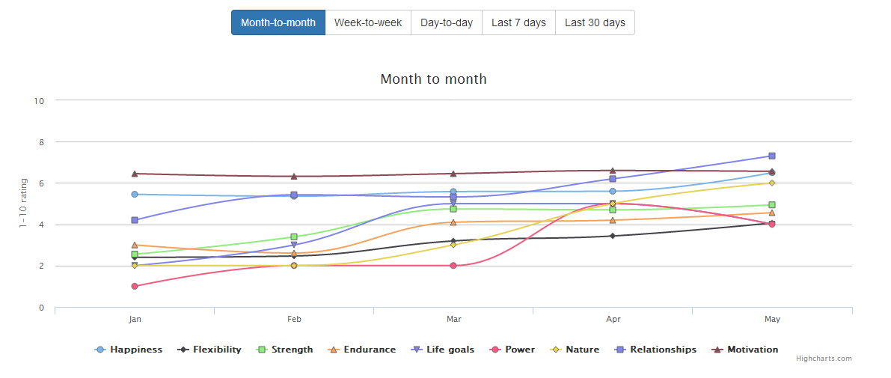

Title: Chin Up motivation tracker
Date: 2014-5-4 15:10
Category: python
Tags: python, web development, development, motivation

[Chin Up](https://github.com/ckcollab/chin-up) is my personal motivation tracker. Every day I rate from 1 to 10 how I am
feeling in certain metrics like strength, flexibility, relationships and happiness.

    

There are two types of metrics:

 * **Daily** - Measured every day
 * **Monthly** - Measured on the first of every month

It is meant to be hosted locally/somewhere free, like [Heroku](http://heroku.com).

    

## What I track

If you want the same setup I have, go to the `admin` screen and add these items.

### Daily checklist (binary=True)
- Vitamins
- Coffee
- 20 pushups for 3 sets
- 20 squats for 3 sets
- 8 pull ups for 3 sets
- (a lot more, this depends entirely on what you do/want to do every day)

### Daily tracking
- Happy
    * 1 being seeing my mom with tubes coming out of her face and head
    * 10 being happiest I've ever been, nothing feels impossible
- Motivated
    * 1 being ultra depressed not even eating
    * 10 being I did everything I needed to and more
- Flexibility
    * 1 being no stretching in chair all day no walking around
    * 10 being I did every stretch possible and did the splits
- Strength
    * 1 being I feel as soft as an 8 year old girl
    * 10 being I squatted and deadlifted the day before--now I can't move
- Endurance
    * 1 being I got winded getting out of my chair
    * 10 being I jump roped for 10 minutes and ran a mile without breathing hard
- Relationship
    * 1 being I got into a huge argument and feel terrible
    * 10 being we made dinner together and wrote each other poetry

### Monthly tracking
- Life goals
    * 1 being no progress towards goals and very depressed
    * 10 being I got a world record deadlift
- Power
    * 1 being no physical activity
    * 10 being I ran and worked out every opportunity I had
- Nature
    * 1 being no outdoor activity
    * 10 being I spent the entire time camping and fishing

## Why?
To become the best I can be: I need motivation, I need to get my chin up.

## How do you measure?
Every metric that I believe significantly effects my motivation and health will be measured on a scale from 1 to 10.
If there is something significant to note, I'll put that down as well. However, the main goal is to motivate myself through
numbers and statistics.

**1 being** the worst, least effort I could possibly put in and **10 being** the best, most effort I could possibly put in.

## Ease of use

    

To make it easier to use, I made a simple app and threw it on pypi called [django-pin-passcode](https://github.com/ckcollab/django-pin-passcode).
It logs you in to the user you define after you enter a certain passcode composed of 0-9 and #.

## Stats

    

 * **Month to month** - Average for the entire month
 * **Week to week** - Average for the entire week
 * **Day of the week** - Average for that day of the week for the last year
 * **7 day** - Last 7 day simple
 * **30 day** - Last 30 day simple

## Correlations

    

Thanks to numpy I added really quick correlations between metrics, it's pretty ugly but it will tell you what metrics
might positively/negatively correlate to each other.
