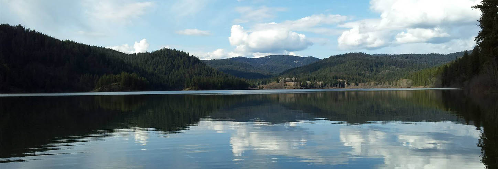

Title: Coeur d Alene Web Developer
Date: 2014-4-28 15:10
Category: web development
Tags: web development, development

I thought I'd take a moment to talk about what I do and where I do it, here it goes!

## Why web development?

I've always loved solving problems. In high school one of my *hobbies*, if you can believe it, was helping out the teachers
by making tools for grading, quizzes and studying.

In college my tastes drifted away from Computer Science. I switched to Education and my plan in life
was to become a teacher. Everything changed when my mother was in a terrible motorcycle accident. She came out of a coma with
a 1% chance to survive, but she suffered massive brain damage.

I dropped out of school and moved home to help, but I needed some way to make a living with a flexible schedule so I could
stay with my mum. I picked back up web development and here I am today about three years later.

## Why North Idaho?

     
    <i><small>Killarney Lake</small></i>

It's beautiful here! I want to raise my family in this great community with safe schools and lots of outdoor activities
to do. Recently I have gotten into Kayak Fishing and North Idaho is the place to do it.

Also there is so much around here for great little one day vacations like the [Davenport](http://www.davenporthotelcollection.com/)
in Spokane with dinner at [Sushi.com](http://www.mainsushi.com/). Or, if you're into French food, one of my other favorite
restaurants is in Post Falls: [Fleur de Sel](http://fleur-de-sel.weebly.com/)&mdash;forgive them for their website!

## #represent

That's how I ended up in web development and why I love CDA!
