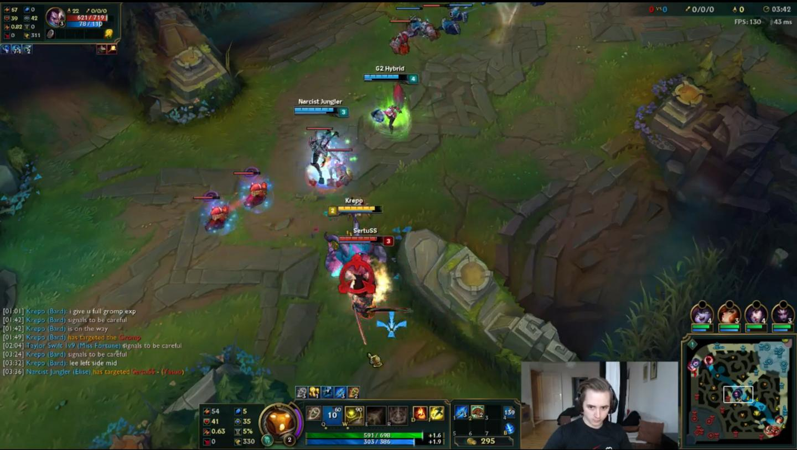
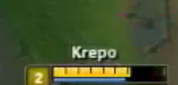

Title: Getting player names from Twitch streams or an exercise in futility
Date: 2015-12-16 15:10
Category: python
Tags: python, web development, development, gaming, league of legends, twitch

I had an idea last month for a site based around identifying Twitch streamers in game, recording game stats,
and then having fantasy league style betting based around the stats... it was a fun experiment but my techniques
ended up not being very practical.

## The Idea

In League of Legends at least, was to find the "yellow health bar" that only your character has.
Once I have the coordinates for the yellow health bar I can look above it to see the character name! Boom,
with the character name I can look up stats and track all of their games automatically.

## The process

For example, watching [Krepo's)(http://www.twitch.tv/skumbagkrepo) stream:

### Get the stream frame

    :::python
    from livestreamer import Livestreamer
    
    while True:
        session = Livestreamer()
        streams = session.streams('http://www.twitch.tv/%s' % streamer)
        if streams:
            stream = streams['source']

            container = av.open(stream.url)
            video_stream = next(s for s in container.streams if s.type == b'video')

            image = None
            for packet in container.demux(video_stream):
                for frame in packet.decode():
                    image = frame.to_image()
                    features = process_image(image)

     

### Find yellow health bar

    :::python
    def _find_our_champion(image, search_step=2, draw_on_image=False):
        # should find the yellow bar underneath our hero and then 
        # we can use the top left of that to center our search area
        data = np.asarray(image)
        # remove any alpha channel in the data so we just have (r, g, b)
        data = data[:, :, :3]
        width, height = data.shape[1], data.shape[0]
        character_name_coords = None
    
        # Cut off the bottom few hundred pixels, not needed
        height -= 200
    
        for y in xrange(0, height):
            hits_this_row = 0
            for x in xrange(0, width, search_step):
                r, g, b = data[y][x]
                if r > 200 and 160 < g < 230 and 30 < b < 70:
                    # really yellow
                    hits_this_row += 1
                if hits_this_row > 20:
                    # Top left and bottom right
                    character_name_coords = (x - 120, y - 35, x + 100, y - 8)
                    if draw_on_image:
                        red = (255, 0, 0)
                        draw = ImageDraw.Draw(image)
                        draw.rectangle(character_name_coords, fill=red)
                    break
            if character_name_coords:
                break
        return character_name_coords

     

### Process the image

    :::python
    def _ocr_name_box(name_box_image):
        # 0 means load in grayscale
        try:
            gray = cv2.cvtColor(np.array(name_box_image), 0)
        except TypeError:
            gray = cv2.cvtColor(name_box_image, 0)
        ret, gray = cv2.threshold(gray, 160, 255, cv2.THRESH_BINARY)
        
        # ocr code below

     

### OCR the final processed image

    :::python
    def _ocr_name_box(name_box_image):
        # processing code above
        
        gray_image = Image.fromarray(gray)
        return pytesseract.image_to_string(gray_image)
        

OCR results: Krepo

So, it worked in this particular case... this was one of the few that did work.

## The results

**NOT GOOD!**

The idea was super fun to pursue but it doesn't perform very well for a few reasons:

 * Streamers can disable showing character name
 * The "yellow health bar" specific to your character can be disabled
 * What region are players on?
 * [PyTesseract](https://pypi.python.org/pypi/pytesseract/) is pretty cool but [Tesseract](https://github.com/tesseract-ocr) is pretty cumbersome to use. Hard to train, seems kind of outdated but definitely decent for being free!
 * The OCR results were pretty bad although I'm sure with mechanical turk + some training we could get it in a decent state, but still.. names could not be shown at all!
 
 
So... it was a fun experiment but not very practical!