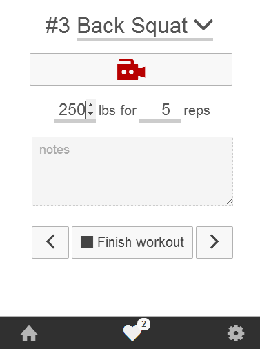

Title: Ionic vs Bootstrap
Date: 2014-4-22 15:10
Category: web development
Tags: ionic, javascript, css, web development, development
Summary: I am writing this as a tool to help me learn more about [Ionic](http://www.ionicframework.com/) and [Bootstrap](http://getbootstrap.com) to decide which, if either, library to use for my new hybrid web app. My app has to look good and function well on desktop, tablet and mobile.


I come from the before times. The times where PHP was it, many were switching from *tables* to *css*, Bush was president and you had to get help from some weird phpBB forum post where the signatures took up half the screen&mdash;and
you LIKED IT!

<p style="text-align: center;" class="image-wrapper">
    <br>
    <i><small>I need a more ominous before picture...</small></i>
</p>

If that's how I think of the times before [Bootstrap](http://getbootstrap.com/), how will I think of Bootstrap 5 years from now?


## Why write this?

I am writing this as a tool to help me learn more about [Ionic](http://ionicframework.com/) and Bootstrap to decide which, if either, library to use
for my new hybrid web app. My app has to look good and function well on desktop, tablet and mobile.

I haven't used Ionic at all, yet, but I have used Bootstrap for over a dozen projects. I love bootstrap, but there are some
things that definitely bug me and I'd love to learn about some alternatives.


<p style="text-align: center;" class="image-wrapper">
    <br>
</p>


## Pain points of Bootstrap

### Grid system

Columns. Rows. Grids.

It's only getting more complex with `.col-md-12`, `.col-xs-12` and such. These things aren't hard to learn, but I had just
gotten the hang of doing the whole `.container` `.row` `.span` dance. Oh, don't forget `.row-fluid` was awesome, too.

```html
<div class="container">
    <div class="row">
        <div class="span12">
        </div>
    </div>
</div>
```

### Requires jQuery

Unforunately Bootstrap requires jQuery, but there is an [awesome repo](https://github.com/tagawa/bootstrap-without-jquery)
that has a version of Bootstrap without the jQuery requirement!

### Everything looks the same

This is a criticism a lot of people have that I don't entirely share, however I thought I'd mention it anyway. Many sites
are using basic bootstrap stuff without tweaking it much&mdash;doesn't really bother me, I think it's an important tool for
developers who aren't designers.


## Things Bootstrap does right

### Great documentation

Boy did they nail it. I feel like Bootstrap had the best documentation of any library a couple years ago, and it still
may hold that title. It's a snap to find what you are looking for, the explanations are easy to understand and there are
examples for nearly everything.

### Super easy to use, proven

Bootstrap is getting more and more mature, people know how to use it and appreciate it. There are lots of tried-and-true
plugins, examples, tutorials, videos, etc. for Bootstrap.

### Tons of nice features

Typeahead, image sliders, on and on. So many useful little features, so easy to use and expand. It's nice to be able to
rely on a library *most* of the time!


<p style="text-align: center;" class="image-wrapper">
    <br>
</p>

## Ionic's iconic infamous items (pros)

### Grid system, 'yall

Shit is written with [FLEXBOX](https://developer.mozilla.org/en-US/docs/Web/Guide/CSS/Flexible_boxes)! I have been waiting for some kind of support for this forever, a good friend of mine
[Levi Thomason](http://levithomason.com) tried to explain it to my glazed over eyes but I think I caught the jist. Flexbox solves a ton of
problems that are normally solved with floats, tricks, and wizardry:

1. Vertical align
2. Things fill in remaining space easily
3. Elements stay where they should (footer stuck to bottom of screen)
4. etc. etc.

### AngularJS instead of jQuery

Ionic is built on top of AngularJS for all of the interactions, that is awesome. AngularJS makes writing front end
stuff so much less painful and so much easier to test. Way back when I couldn't imagine writing tests for jQuery stuff,
how would I emulate so many DOM elements?

AngularJS helps you write unit-testable code by abstracting away the DOM, instead you play around in a `$scope`
where all data is stored.


## Ionic's inconceivable integrations (cons)

### Kind of confusing docs/dist

Maybe it's because I am so used to how Bootstrap has everything laid out, but it just feels a little wonky and lacking
sometimes. For example, how the hell do I use that awesome list of animations? How do I use gestures? I had to look at
the source code to figure out what I was doing wrong.

### Purely mobile

Ionic is built only for mobile, which is a big problem for me because I want to design a hybrid mobile/desktop app.

However, I feel like I just need to "do it" and try. Every other UI framework I've used on mobile has performed terribly,
but Ionic has been doing pretty good so far.

### Colors/styles

I'm not a huge fan of the colors/styles available now, but I am sure that will get better as the project matures. Do we
really need like 10 colors for buttons?


## Conclusion

Ionic seems to only support mobile, although it says it is a Hybrid framework. I feel like Bootstrap is much better at
doing desktop. This comparison seems more apples to orange than I first suspected, these frameworks are solving totally
different things.

I am going to give Ionic a shot for my next app even though it only seems to support mobile, I have already started and
it's not going terribly, here's what I have so far for my workout tracking app:


<p style="text-align: center;" class="image-wrapper">
    <br>
    <i><small>Workout entry screen. This took a few hours and looks terrible but,<br> I'm happy with the performance so far!</small></i>
</p>


## All jokes aside

I am a shoot from the hip kind of guy, I like to do things fast&mdash;if I messed up on any details about Bootstrap or
Ionic, please correct me!

Is something easier than I am making it seem? Am I doing something wrong? Let me know! I plan to update this as I learn
more.
