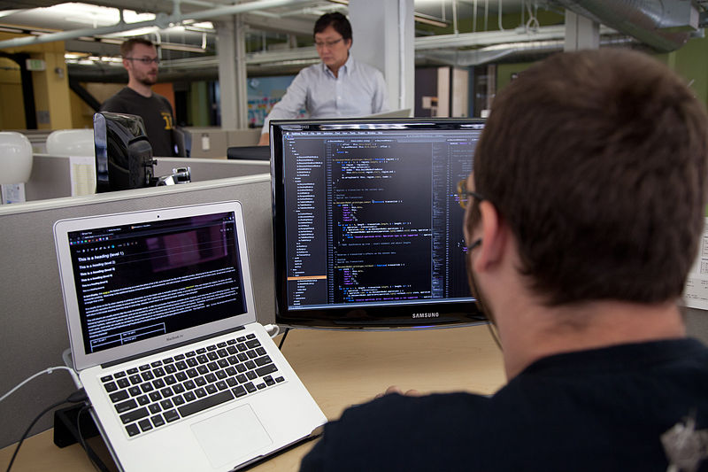

Title: Python Interview Tests
Date: 2014-5-1 15:10
Category: python
Tags: python, web development, development, hiring, employment
Summary: I have been applying to a lot of jobs lately and I've done quite a few "prove you know what's up" tests and projects. I think it might be a good exercise to go over them in my head and talk about how everyone could win from these tests.   Note: this write up is meant for **remote** development work!

I have been applying to a lot of jobs lately and I've done quite a few "prove you know what's up" tests and projects. I
think it might be a good exercise to go over them in my head and talk about how everyone could win from these tests.

Note: this write up is meant for **remote** development work!

## When are employment tests good?

I think tests for entry level/junior positions are necessary to prove:

 * Understanding of fundamentals (list, tuple, etc.)
 * Experience with testing (nose, pywebtest, selenium)
 * Experience with an ORM/SQL
 * They are a self-starter and motivated

## When are employment tests not as helpful?

If the position you are trying to fill is for an expert or senior level position that applicant should already have ample code samples and
open source contributions to go through. I don't think it's necessary to check for fundamentals in this situation. It'd
 be more important to me that the person is a good fit personality wise for the team.

For a senior position it might be more valuable to give them a problem and ask how they would organize a team to solve it?
Not sure, I'm still a Junior!

     
    <i><small><a href="http://www.jisc.ac.uk/blog/identifying-resources-for-students-by-students-03-may-2013">Photo by JISC</a></small></i>

## What are useful takeaways?

A good employment test should give the interviewee an opportunity to showcase their skillset.

For example, if testing someone for a Django/Python environment:

 * They understand the WSGI-way of building web apps, django views vs class based views, mixins, etc.
 * They should be able to write unit tests and functional tests with selenium
 * They should be able to do queries with the ORM and build models
 * Given very specific instructions, they should be able to finish the test in a reasonable amount of time.
 * Give opportunities to showcase something interesting

### A good experience I had

In one test I made up a set of models and as a bonus the employers asked me to write up a strategy to test the models.

Not only does this give me an opportunity to strut-my-stuff, but it makes the problem just a little more interesting.
I started to open up my brain and think of ways to test the code which made me think more clearly about the overall
 architecture&mdash;and it was fun!

### A bad experience I had

If your interviewee is completely baffled by the test because it's so specific and they could solve the problem using their
own tools: that is a bad experience for everyone. Valuable time is soaked up during the test Googling how to use library
X and framework Y.

Instead, the applicant should be encouraged to use whatever strategy they see fit to solve the problem
and then they should be tasked with explaining *why* they chose that route. Often times when you meet someonew new,
they have a few tricks up their sleeve you may have never seen before!

### Another bad experience I had

The test was super vague, as if the person who wrote the test didn't care much about the end result. It bothered me
that there was a one paragraph explanation and so much openness. No real time limit, no concrete goals. Also, when I asked
 for more details it took almost a week to get a response. The lack of response made me lose interest in that position.

     
    <i><small><a href="http://commons.wikimedia.org/wiki/User:Matthew_(WMF)">Photo by Matthew Roth</a></small></i>

## What are less useful takeaways?

 * They know how to do some obscure binary arithmetic.
 * Large chunks of the test not entirely related with the position's description, like applying for a Python position but
  being tested on ASP.
 * Solving a problem within very particular restrictions.

## When testing an employee for remote work

### Do

 * Be super organized and descriptive.
 * Leave the interviewee alone, only a few questions should be asked. If you are too available it might get the interviewee
  out of the creative headspace and into the follow-the-leader headspace.
 * Test internally first, if no one else can pass your test then it may be too obscure.
 * Take as many parts of setup out of the equation as you can: git vs mercurial, database fixtures. Allow the interviewee
 some latitude to solve problems.

### Don't

 * Change/improve instructions during testing, it breaks focus and uses up valuable nervous energy.
 * Put off answering interviewee questions.
 * Put short time limits, give them a way to prove speed but at the same time architect something nice.
